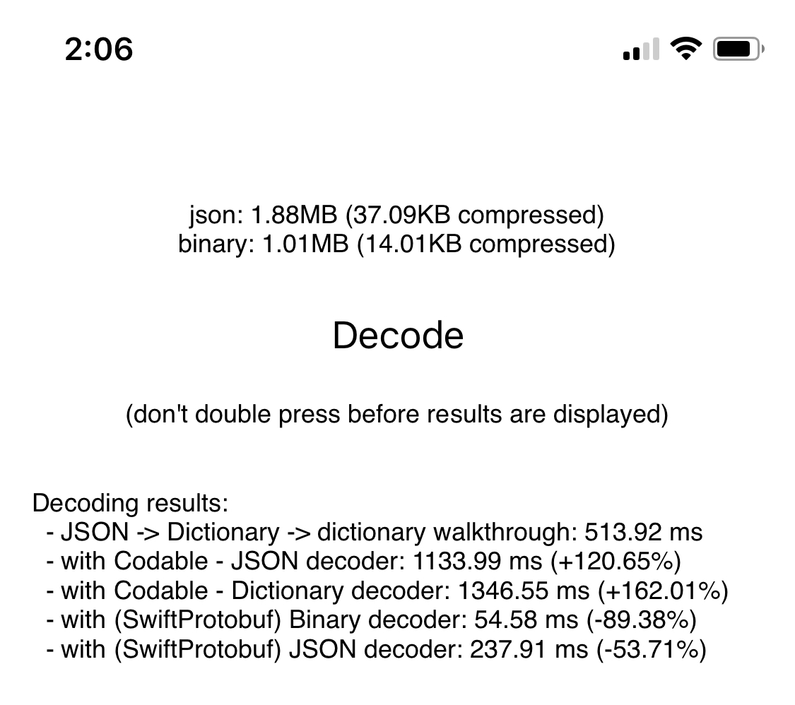

## Decoding experimentations

This project tests different approaches to decoding and measures the performance of each:
	- parsing the JSON as a dictionary and iterating over the dictionary
	- using `Codable` and `JSONDecoder`
	- using `Codable` and [`DictionaryDecoder`](https://github.com/elegantchaos/DictionaryCoding)
	- using Protobuf and [SwiftProtobug](https://github.com/apple/swift-protobuf)

### Setup
The script `structGeneration.js` will generate random structs (for `Codable`, `Protobuf`...) to test benchmark different scenarios.

You can edit the parameters describing the depth and width of the payload, and iterate a few times until you have a result you like (the output are random)

```bash
node structGeneration.js
```

### Measurement
Build the app **using Release Configuration** to a device, hit the `Decode` button and wait!


